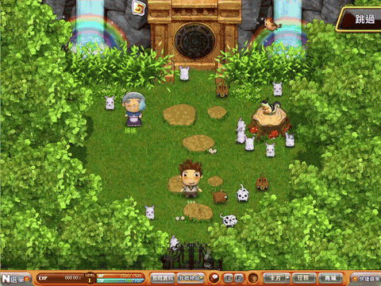
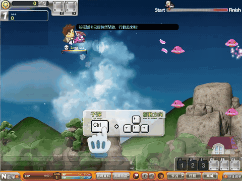

# Nanaimo

[](https://github.com/brucerry/nanaimo/actions/workflows/windows-build.yml)
[](https://www.gnu.org/licenses/agpl-3.0)

A local Windows game with a C# launcher, managed gameplay server, and native dungeon bridge.

## Gameplay

| Village tutorial | Air battle |
| --- | --- |
|  |  |

---

## Play

Clone the repository, then open the included portable application. No build, SDK, or Python installation is needed to play.

1. Run `git clone https://github.com/brucerry/nanaimo.git` and open the cloned folder.
2. On Windows 10 or 11 **x64**, open `client/Start-Game.exe`.
3. Enter an account name, choose a windowed size or fullscreen mode, then choose **Log in and play**.
4. A new name creates a new account; the game then opens character creation.
5. Reuse the same account name to resume. Exit the game before stopping its server.

There is no automatic default account. The portable build includes its .NET runtime.\
New characters receive no preset coins, cash, or skill points and begin with the tutorial.\
Local accounts do not need passwords; this application is intended for local play.\
Windowed presets range from 800 × 600 to 3840 × 2160; fullscreen uses your display resolution. Widescreen stretches the original 4:3 image, and anti-aliasing is selected automatically. The renderer requires a DirectX 10-capable GPU (see the [renderer notice](client/dgVoodoo-NOTICE.txt)).\
The checkout includes roughly 2 GB of game assets and runtimes. Git LFS is not required.

Saves are in `client/server/server-merged/data/`. Back up that entire directory with the game and server stopped. The last account entered is stored in `client/server/launcher/local-account.json`. GM tools edit offline characters.

For launch failures, inspect `client/server/launcher.log` and `client/server/server-merged/server-error.log`.

---

## Build from source

Use Windows x64, PowerShell, the [.NET 8 SDK](https://dotnet.microsoft.com/download/dotnet/8.0), and Python 3.12 or newer. Start in the repository root:

```powershell
powershell -NoProfile -ExecutionPolicy Bypass -File server/tools/setup-tcc.ps1
python -m pip install -r server/tools/requirements-localization.txt
powershell -NoProfile -ExecutionPolicy Bypass -File server/tools/test-windows-build.ps1
```

The setup script downloads TinyCC 0.9.27 from its official distribution and verifies its SHA-256. The build checks do not depend on prebuilt executables; a source-only export was also tested.\
Run package checks in a fresh checkout, because they deliberately reject existing player saves.\
The checks publish the .NET 8 launcher and server for `win-x64`, compile the native bridge and entry point, run server integration and WinForms launcher checks, test locale conversion, and verify the managed executable architecture. Synthetic test accounts are confined to `server/tools/checks/`; no player database is created.

To rebuild the portable installation without running checks:

```powershell
powershell -NoProfile -ExecutionPolicy Bypass -File server/src/scripts/build_merged.ps1 -ModernOnly
powershell -NoProfile -ExecutionPolicy Bypass -File launcher/build.ps1 -ModernOnly
```

Run these builds sequentially because they share a project. Output goes to `client/server/` and `client/Start-Game.exe`. The included game assets stay in `client/`; rebuilding preserves them.

The included portable package has x64 managed programs. The game client, native bridge, and entry point are x86. To build a separate x86 managed runtime, pass `-Architecture x86` to both build scripts. Omitting `-ModernOnly` also builds the Windows 7 .NET 6 variants, which require Windows SDK Universal CRT redistributables. These optional outputs are local and excluded from Git.

For a local Windows 7 x64 build, run the two commands above without `-ModernOnly`. For x86 outputs, add `-Architecture x86` to each command.\
`Start-Game.exe` selects the x86 runtime automatically on 32-bit Windows; on a 64-bit test machine, pass `--x86` to select it. Pass `--win7` to test the Windows 7 target on a newer Windows host.

---

## Structure

| Path | Purpose |
| --- | --- |
| `launcher/` | C# WinForms launcher and native C entry point |
| `server/src/managed/` | Protocols, gameplay, and SQLite persistence |
| `server/src/managed-host/` | Server host and integration checks |
| `server/src/adapter/`, `server/src/release/components/` | Native dungeon bridge and simulation |
| `server/config/` | Neutral compatibility settings; no account identity |
| `localization/zh-HK/` | Editable dialogue, UI, launcher, and diagnostic wording |
| `server/tools/` | Localization, build, audit, and cleanup tools |
| `.github/workflows/windows-build.yml` | Windows x64 and x86 build checks |

The stack is C# 12, .NET 8, WinForms, Microsoft.Data.Sqlite, C/TinyCC, and Python.\
The proprietary client source is not available. The modern portable binaries, artwork, and locale templates are included for clone-and-run use. Accounts, saves, logs, historical copies, toolchains, and build intermediates stay outside Git.

---

## Edit game text

Edit the UTF-8 JSON files in [localization/zh-HK](localization/README.md), then run:

```powershell
python server/tools/build_game_locale.py
python server/tools/build_game_locale.py --apply
python server/tools/audit_language.py --active-only
```

Asset generation uses the included client and `localization/templates/` images.\
The source conversion unit tests also use synthetic fixtures. Rebuild the server and launcher after changing `managed.json`. Keep filenames, identifiers, comments, and documentation in English. See the [editing guide](server/src/docs/localization.md) for encoding, layout limits, and local asset checks.

---

## CI and desktop verification

Pushes and pull requests build and run self-tests for both x64 and x86 managed programs on GitHub's `windows-2022` and `windows-2025` x64 runners. A separate `windows-2022` job builds and runs the .NET 6 x64 and x86 Windows 7 targets.\
These Windows Server jobs exercise x86 under WOW64; they cannot certify gameplay on Windows 7 or on 32-bit Windows 10 installations.

The manual workflow can additionally run x64 and x86 process checks on actual Windows 10 and 11 x64 machines. Configure dedicated self-hosted runners with labels `nanaimo-windows-10` and `nanaimo-windows-11`, then enable **desktop_tests** when running the workflow. Windows 11 has no 32-bit edition, and GitHub's runner software does not support Windows 7 or 32-bit Windows. The Windows 7 targets therefore remain compatibility builds, pending separate hardware or VM testing.\
See [GitHub's runner documentation](https://docs.github.com/en/actions/reference/runners/github-hosted-runners).

---

## Clean local data

The cleanup command previews the exact paths by default:

```powershell
powershell -NoProfile -ExecutionPolicy Bypass -File server/tools/clean-workspace.ps1
# Permanently remove all accounts, saves, logs, historical scratch files, and build intermediates:
powershell -NoProfile -ExecutionPolicy Bypass -File server/tools/clean-workspace.ps1 -Apply
```

Close the game, launcher, server, and workspace tools first. The applied cleanup also resets compatibility settings to the neutral template. It keeps current game assets, runtime executables, source, and Git history. `.gitignore` independently prevents private runtime files and generated output from entering a normal commit.

---

## License and references

Project source uses [AGPLv3](LICENSE). Third-party components retain their own licenses. This does not grant rights to redistribute proprietary game binaries or artwork; see [third-party notices](server/src/docs/third-party-notices.md).

[Server guide](server/README.md) · [GM guide](server/src/docs/gm-guide.md) ·
[Architecture](server/src/docs/merged-server.md) · [Language guide](server/src/docs/localization.md)
